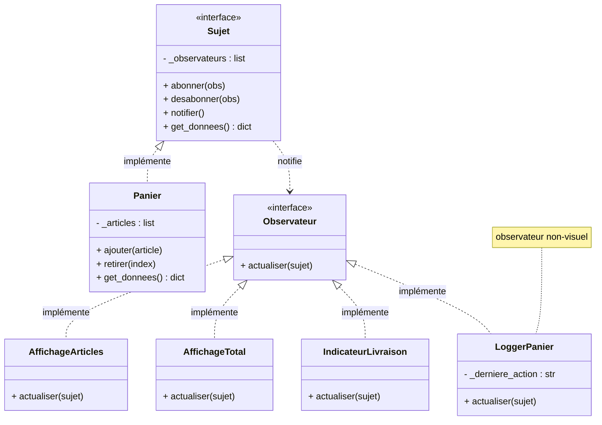

# Diagramme UML — Projet B : Panier d'achat

Ce diagramme montre l'architecture cible à implémenter.
Aucun squelette n'est fourni — vous devez créer la structure vous-mêmes.



---

## Structure de fichiers suggérée

```
panier/
├── main.py
├── models/
│   ├── subject.py       ← interface Sujet (à créer)
│   └── panier.py        ← sujet concret (à créer)
├── observers/
│   ├── observer.py      ← interface Observateur (à créer)
│   ├── affichage_articles.py  ← à créer
│   ├── affichage_total.py     ← à créer
│   ├── indicateur_livraison.py ← à créer
│   └── logger_panier.py       ← à créer
└── views/
    └── dashboard.py     ← à créer
```

---

## Ce que `get_donnees()` doit retourner

```python
{
    'articles': self._articles,   # liste de dicts {"nom": ..., "prix": ...}
    'total': ...,                 # somme des prix
    'derniere_action': ...,       # "AJOUT" ou "RETRAIT" + nom de l'article
}
```

## Seuil de livraison gratuite

```python
SEUIL_LIVRAISON = 50.0
```

- Si `total >= 50.0` → afficher `"✓ Livraison gratuite !"` en vert
- Sinon → afficher `"Ajoutez X.XX $ pour la livraison gratuite"` en gris
